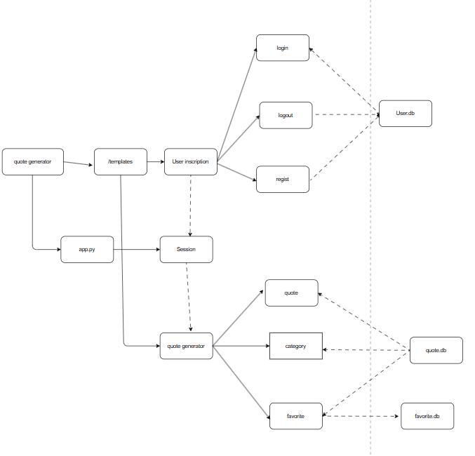
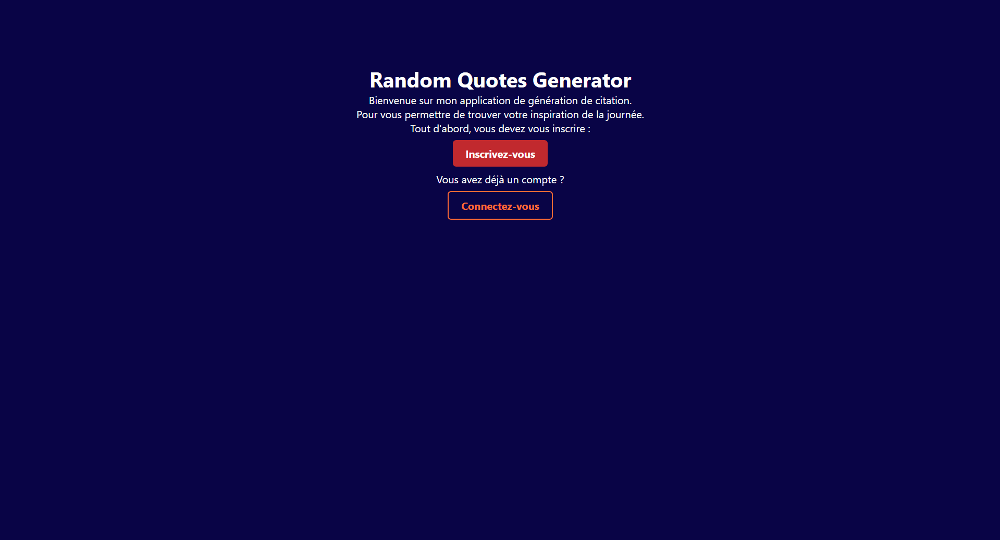

# Random Quotes Generator

## Introduction

Le **Quote Generator** est une application web développée avec **Flask** et **SQLite**.  
Elle permet aux utilisateurs de s’inscrire, de se connecter, de parcourir les citations par catégorie et de sauvegarder leurs citations préférées dans leurs favoris.

  
  


**Objectif pédagogique** : Apprendre l’authentification, la gestion des bases de données et l’utilisation des templates Flask (Jinja2).

---

## Fonctionnalités

- Inscription et connexion utilisateur  
- Gestion des sessions  
- Hashage sécurisé des mots de passe  
- Choix des catégories de citations  
- Affichage aléatoire d’une citation  
- Copier une citation  
- Partager une citation  
- Ajout / suppression des favoris  
- Historique des favoris par utilisateur  

---

## Architecture du projet

- **Backend** : Flask (Python)  
- **Frontend** : HTML, CSS, JavaScript (templates Jinja2)  
- **Base de données** :  
  - `user.db` → utilisateurs  
  - `quotes.db` → catégories et citations  
  - `favorite.db` → favoris liés aux utilisateurs  



---

## Structure des fichiers

```bash
quote-generator/
│── app.py
│── templates/
│    ├── index.html
│    ├── login.html
│    ├── regist.html
│    ├── profil.html
│    ├── category.html
│    ├── quotes.html
│    ├── favorite.html
│── static/
│    ├── style.css
│── user.db
│── quotes.db
│── favorite.db

```

---

## Installation et Execution

``` bash
git clone <https://github.com/Rocky1324/quote-generator>
cd quote-generator
pip install flask werkzeug
python app.py
```
- Lancer l’app sur http://127.0.0.1:5000

---

## Exemples d'utilisation

1. Inscription: Creer un compte utilisateur
2. Connexion: Accedrer au profil
3. Choix de categorie: ex: Inspiration -> Affiche une fiche aleatoire
4. Ajout aux favorits: clic bouton "Ajouter aux favorits" -> Ajout dans favorite.db
5. Affichage favorits: liste personnalise par utilisateur
6. Copier une citation / Partager une citation 




[Telechargez la vidéo de démonstration](https://drive.google.com/file/d/19Lm_wlHQ1ROa_GiBpXfyEP8dRZ0IZEYA/view?usp=sharing)

---

## Amelioration futures

- Pagination des citations dans favorits
- Ajout de sa propre citation (CRUD complet)
- API REST pour exposer les citations
- Version mobile-friendly avec un meilleure design
- Authentification avec OAuth (Google, GitHub)
- Classement des citations par popularite
- Systeme de tags pour les citations
- Test unitaires (PyTest)

---

## License

Projet realise dans un but pedagogique

**License**: MIT


